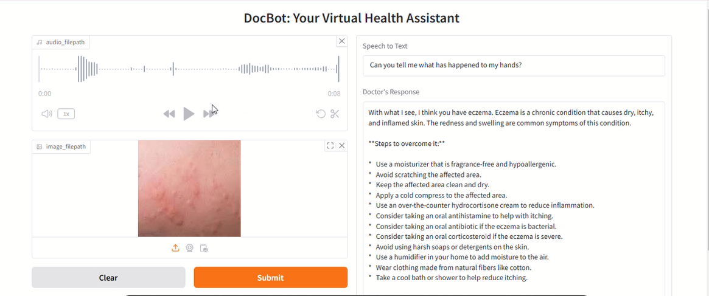

# 🏥 Medical Advice Engine

## 📚 Overview
This AI-powered engine analyzes **medical images** and **text queries** for preliminary advice using Groq API and Llama-3.2 Vision Model.

## 🚀 Features
- 🏥 **AI-Powered Diagnosis** using Groq API.
- 🎨 **Image Processing** with Base64 encoding.
- 🤖 **Multimodal LLM Model** for text+image input.
- 🔑 **Secure API Key Handling**.

---


## 🛠️ Setup & Installation
### 1️⃣ Install Visual Studio Code (VS Code)
First, download and install **VS Code** from the official website: [VS Code Download](https://code.visualstudio.com/).

### 2️⃣ Clone Repository
```bash
git clone https://github.com/AyeshaJavaid676/Final-Project-AI-Doctor.git
cd medical-advice-engine
```

### 3️⃣ Setup Virtual Environment with Pipenv
```bash
pip install pipenv  # Install pipenv if not already installed
pipenv install groq  # Install dependencies in a virtual environment
pipenv shell  # Activate the virtual environment
```

### 4️⃣ Setup .env File
Create a `.env` file in your project directory and add:
```
GROQ_API_KEY=your_groq_api_key_here
EVENLABS_API_KEY=your_evenlabs_api_key_here
```
Then, load it in your Python script:
```python

GROQ_API_KEY = os.getenv("GROQ_API_KEY")
EVENLABS_API_KEY = os.getenv("EVENLABS_API_KEY")
```

---

## 🌐 Installing FFmpeg, PortAudio, and Gradio
### 5️⃣ Install FFmpeg
#### **Windows:**
1. Download **FFmpeg** from [FFmpeg Official Website](https://ffmpeg.org/download.html)
2. Extract it and copy the `bin` folder path (e.g., `C:\ffmpeg\bin`)
3. Add it to your system environment variable `PATH`:
   - Search **Environment Variables** in Windows.
   - Edit `Path` and add the **FFmpeg `bin` directory path**.


### 6️⃣ Install PortAudio and PyAudio
```bash
pip install pyaudio
```
If **PortAudio installation fails**, install it manually:
- **Windows:** Download from [PortAudio](http://portaudio.com/download.html) and add it to `PATH`.


### 7️⃣ Install Gradio
```bash
pip install gradio
```

---

## 📋 How It Works

### 🔹 Step 1: Setup API Key
```python
import os
GROQ_API_KEY = os.getenv("GROQ_API_KEY")
EVENLABS_API_KEY = os.getenv("EVENLABS_API_KEY")
```

### 🔹 Step 2: Setup Text-to-Speech (TTS) Models
#### **Using gTTS**
```python
from gtts import gTTS

def text_to_speech_with_gtts(input_text, output_filepath):
    language="en"
    audioobj = gTTS(text=input_text, lang=language, slow=False)
    audioobj.save(output_filepath)
```

#### **Using ElevenLabs**
```python
import elevenlabs
from elevenlabs.client import ElevenLabs

ELEVENLABS_API_KEY = os.environ.get("ELEVENLABS_API_KEY")

def text_to_speech_with_elevenlabs(input_text, output_filepath):
    client = ElevenLabs(api_key=ELEVENLABS_API_KEY)
    audio = client.generate(
        text=input_text,
        voice="Aria",
        output_format="mp3_22050_32",
        model="eleven_turbo_v2"
    )
    elevenlabs.save(audio, output_filepath)
```

### 🔹 Step 3: VoiceBot UI with Gradio
```python
import gradio as gr

from voice_of_the_patient import transcribe_with_groq
from Doctor_Voice_Module import text_to_speech_with_gtts, text_to_speech_with_elevenlabs

system_prompt=""" You have to act like a professional doctor.
            What's in this image?. Do you find anything wrong with it medically? 
            If you make a differential, suggest some remedies for them. 
            Don’t respond as an AI model; answer like a real doctor."""

def process_inputs(audio_filepath, image_filepath):
    speech_to_text_output = transcribe_with_groq(
        GROQ_API_KEY=os.environ.get("GROQ_API_KEY"), 
        audio_filepath=audio_filepath,
        stt_model="whisper-large-v3"
    )
    
    doctor_response = "Analyzing medical insights..."
    voice_of_doctor = text_to_speech_with_elevenlabs(input_text=doctor_response, output_filepath="finall.mp3") 
    
    return speech_to_text_output, doctor_response, voice_of_doctor

iface = gr.Interface(
    fn=process_inputs,
    inputs=[gr.Audio(sources=["microphone"], type="filepath"), gr.Image(type="filepath")],
    outputs=[gr.Textbox(label="Speech to Text"), gr.Textbox(label="Doctor's Response"), gr.Audio("Temp.mp3")],
    title="DocBot: Your Virtual Health Assistant"
)

iface.launch(debug=True, share=True)
```

---

## 🛡️ Error Handling
```python
if not GROQ_API_KEY:
    raise ValueError("GROQ API Key is not set! Please check your environment variables.")
```

---
## 📺 Project Demo walkthrough
Click the image below to watch the full project execution on Google Drive:

[](https://drive.google.com/file/d/1byJuXI1b8M0kh72PsZrz9TIp7E7XBk0N/view?usp=sharing)

*Note: This video covers the end-to-end workflow, including data ingestion and final result visualization.*

## 💪 Future Enhancements
- ✅ **Batch Image Processing**.
- 🎯 **Medical Term Validation**.
- ⚡ **Optimized API Calls**.

---

## 👨‍💻 Contributors
 Ayesha Javaid

---

## 📝 License
This project is licensed under the **MIT License**.

---

## 🌟 Support
If you find this project useful, give it a ⭐ on GitHub!

---


